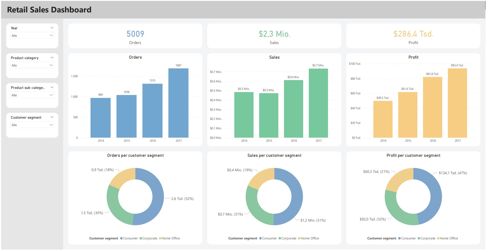
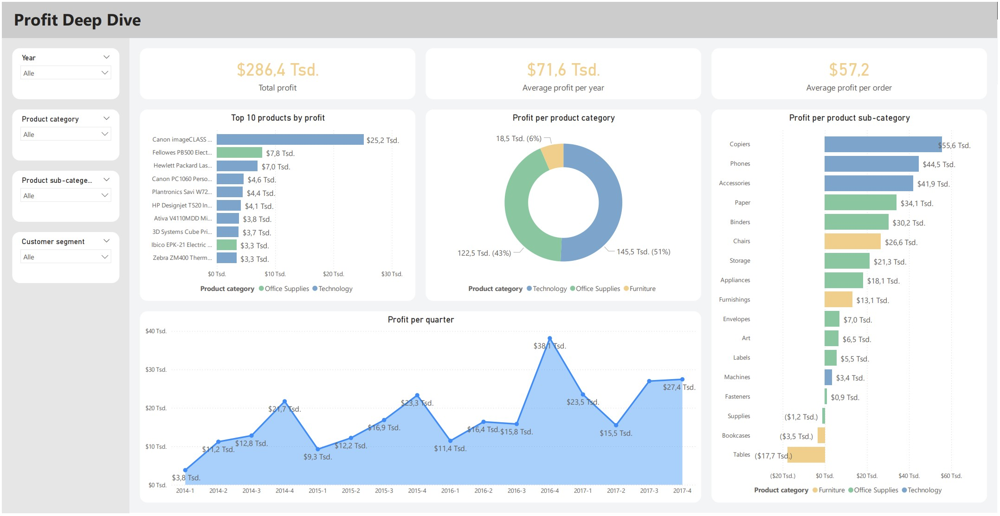

## PostgreSQL Database and Power BI Dashboard for Retail Sales Analysis
This project demonstrates how to transform raw retail data into a structured PostgreSQL database and build interactive dashboards in Power BI for business analysis.
The goal is to simulate a real-world business intelligence project.
From database design and data transformation to interactive dashboard development.

## Overview
The project includes:
- Designing and setting up a PostgreSQL database
- Transforming a single raw dataset into facf and dimension tables (star schema)
- Loading the transformed data into the database tables
- Connecting Power BI to PostgreSQL via Power Query
- Building interactive and visual dashboards in Power BI

## Final Dashboards

1. **Retail Sales Dashboard**

This dashboard provides a high-level executive summary for Orders, Sales and Profit of a Superstore selling various products.

2. **Profit Deep Dive**

This dashboard focuses on the profit in more detail.

## Dataset
The dataset used in this project is the 'Superstore dataset' available on Kaggle:
https://www.kaggle.com/datasets/vivek468/superstore-dataset-final

The dataset contains:
- Orders
- Customers
- Products
- Sales
- Profit
- ...

## Data Modeling
The dataset is made of only a single csv-file containing all data.
This raw dataset was transformed into a star schema using PostgreSQL.
It consists of the following tables:
- fact_orders
- fact_products_to_orders
- dim_products
- dim_customers

## Technologies used
- **PostgreSQL** - Database design and data storage
- **Microsoft Power BI** - Data visualization and dashboard creation
- **Data Analysis Expressions (DAX)** - Creating measures within Power BI
- **Visual Studio Code** - Writing SQL queries
